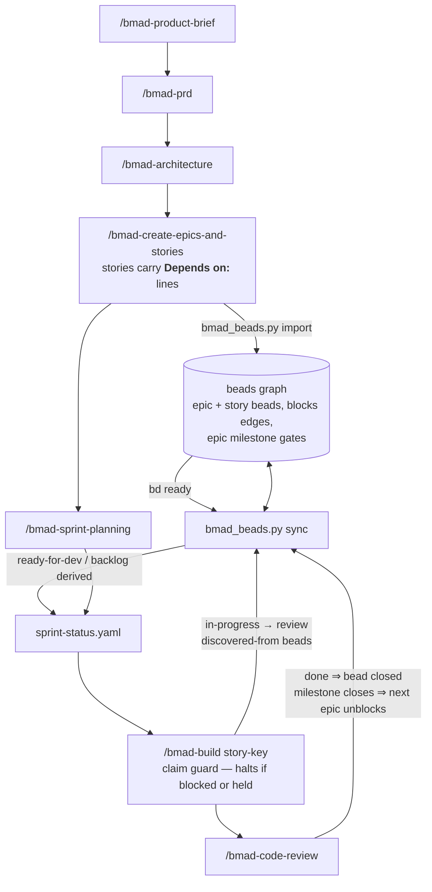
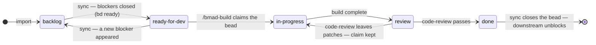

# bmad-beads-template

A GitHub template repo that wires **[BMAD Method v6](https://github.com/bmad-code-org/BMAD-METHOD)**
(ideation → PRD → architecture → epics) to **[beads](https://github.com/gastownhall/beads)**
(a Dolt-backed dependency graph and memory for coding agents), so a long-running project keeps
its *thinking* in BMAD's documents and its *execution state* in a graph that agents can query.

Neither tool is forked. BMAD is extended only through its sanctioned `_bmad/custom/*.toml`
overrides; beads is driven only through `bd --json`. Both upgrade independently.

## Why both

| Need | BMAD alone | beads alone | Together |
|---|---|---|---|
| Decide what to build, explicitly | ✅ brief/PRD/architecture | ✗ | BMAD |
| Stories with acceptance criteria | ✅ `epics.md` | ✗ | BMAD → imported |
| Which story can start *now*, across epics | ✗ (linear order per epic) | ✅ `bd ready` | beads → derived into `sprint-status.yaml` |
| Several people/agents without collisions | ✗ | ✅ `--claim`, hash IDs, Dolt merge | beads |
| Work discovered mid-story, not lost | prose in a spec | ✅ `discovered-from` | beads |
| Context that survives compaction/sessions | re-read documents | ✅ `bd prime`, `bd remember` | beads |
| Unattended per-story build with review | ✅ `bmad-build` / `code-review` | ✗ | BMAD, status mirrored |

The bridge gives every fact exactly one owner (see `AGENTS.md`), which is what keeps this from
becoming two status boards that disagree.

## Quick start

```bash
gh repo create my-project --template chhudson/bmad-beads-template --private --clone
cd my-project
bash scripts/bootstrap.sh         # installs BMAD + beads, wires hooks, runs doctor
git add -A && git commit -m "bootstrap BMAD×beads"
```

Prerequisites: git, Node ≥ 20.12, [uv](https://docs.astral.sh/uv/), and [Task](https://taskfile.dev)
for the `task …` shortcuts (optional: each task wraps one command you can run directly). `bd` is
installed by the bootstrap if missing (`npm i -g @beads/bd` or `brew install beads`).

Then in Claude Code:

```
/bmad-help                                  # BMAD tells you the next step
bd mol pour bmad-planning --var initiative="my thing"   # optional: planning steps as beads
```

## The loop



The skill→bridge arrows are `on_complete` lines in `_bmad/custom/<skill>.toml` running
`scripts/bmad_beads.py`. Run `task status` (or `uv run scripts/bmad_beads.py status`) any time.

### Story lifecycle



Status only moves forward, with exactly two sanctioned reversals: `ready-for-dev → backlog`
(a blocker appeared) and `review → in-progress` (code-review sent the story back). Both
directions are mirrored by `sync`; nothing else ever demotes a story. A story bead is never
closed by hand: `sync` closes it from the `done` code-review writes. The one exception is a
story cut in correct-course, closed with `bd close <id> --reason "…"`.

## What's in the template

```
AGENTS.md                      operating protocol for any agent (Claude Code, Codex, humans)
CLAUDE.md                      points at AGENTS.md; project facts go below the line
.claude/settings.json          SessionStart → bd prime; read-only bd + bridge commands pre-allowed
.claude/commands/update-template.md          /update-template: take a new template release, resolve conflicts
_bmad/custom/*.toml            BMAD overrides: dependency convention, claim-on-start, sync-on-complete
.beads/formulas/bmad-planning.formula.toml   planning phases as a beads molecule
scripts/bmad_beads.py          the bridge: import | sync | claim | status | doctor  (stdlib only)
scripts/test_bmad_beads.py     bridge tests: parser, sprint-status editor, import/sync/claim against a fake bd
scripts/bootstrap.sh           idempotent setup (BMAD_VERSION / BD_VERSION pin the pair)
scripts/canary.py              one story lifecycle against the installed BMAD + bd (weekly in CI)
scripts/update_from_template.py   three-way merge of a newer template release into a project
UPGRADING.md                   per-release steps the updater prints; .template-version records the release
Taskfile.yml                   task status | ready | import | sync | doctor | test | canary | plan | template:update
docs/BLUEPRINT.md              the design: ownership, data flow, failure modes, team modes
docs/references/               vendored standards + library docs; README.md is the manifest (anti-AI-slop shipped)
.github/workflows/bmad-beads-bridge.yml      CI for the BRIDGE only — add your project's own workflow
.github/workflows/upstream-canary.yml        weekly canary against @latest BMAD + bd (opt-in outside the template: UPSTREAM_CANARY=on)
```

`_bmad/` (skills, config) and `.beads/` (database) are created by the bootstrap, not shipped —
so the template never pins a stale BMAD or beads version.

## Team modes

- **Default — per-clone embedded Dolt.** Each clone has its own `.beads/embeddeddolt/`;
  `bd dolt push` / `bd dolt pull` sync through the normal git remote under `refs/dolt/data`.
  No infrastructure; conflicts merge at the cell level.
- **Shared server — `scripts/bootstrap.sh --server`.** Points every clone (and every parallel
  agent on one machine) at one `dolt sql-server`. Use when many agents write concurrently;
  embedded mode is single-writer per clone.

See `docs/BLUEPRINT.md` for the full design and the things that will bite you.

## Updating from the template

A repo made with "Use this template" shares no git history with the template, so it can't
`git pull` a new release. The updater merges each file instead:

```bash
uv run scripts/update_from_template.py --dry-run   # what would change
uv run scripts/update_from_template.py             # newest release (or --ref vX.Y.Z)
```

Or run `/update-template` in Claude Code, which runs the updater and then resolves any conflicts.
Projects made before v0.3.0 don't have the script yet; run it from the template:
`uv run https://raw.githubusercontent.com/chhudson/bmad-beads-template/v0.3.1/scripts/update_from_template.py`.
If Claude Code's auto mode blocks running a script from a URL, type the command yourself with a
leading `!`, then run `/update-template` to finish.

It works out which release the project came from (`.template-version`, or by matching files
against every template commit, so a project made from `main` between releases is found too),
then for each file the template changed:

| Your copy | What happens |
|---|---|
| untouched since your release | replaced with the new version |
| customised | three-way merged; your edits are kept. JSON is merged by key, `.gitignore` as a set of lines, and every merged file must still parse |
| customised where the template also changed the same lines | **left exactly as it was.** The base, your and the new versions are saved to `.template-update/<timestamp>/conflicts/` and listed in `CONFLICTS.md`; `/update-template` merges them for you |
| new in the template | added |
| removed from the template, or deleted by you | kept as it is, and reported |

`README.md` and `CLAUDE.md` are yours and never touched. To stop updates to a file you've taken
over, list it (or a glob) in `.template-ignore`; the updater then only tells you when the template
changes it. `--skip <glob>` does the same for one run.

It refuses to start with uncommitted changes. Every run leaves `.template-update/<timestamp>/`
with a backup of each file it changed, a `REPORT.md`, and an `undo.sh` that restores exactly those
files and deletes the ones it added. Afterwards it runs the bridge tests and prints the release's
manual steps from `UPGRADING.md`. Review with `git diff`, then commit.

## Status

Validated against BMAD Method **6.12.0** and beads **1.3.0** (Sep 2026) by the upstream
canary (`scripts/canary.py`): a fresh bootstrap, BMAD's own `sprint_plan.py` writing
`sprint-status.yaml`, then import → claim guard → review → done → milestone cascade, with
BMAD's `validate` accepting the result. That run caught one bd 1.3 change (a bead can only be
closed by its assignee), which the bridge now handles. The full dogfood cycles, two of them on a
real project with a cold agent in round two, ran in Aug 2026 on BMAD 6.11.0 / beads 1.2.2.

`bootstrap.sh` installs `@latest` of both unless you pin them
(`BMAD_VERSION=6.12.0 BD_VERSION=1.3.0 bash scripts/bootstrap.sh`), and `doctor` warns when the
installed pair differs from the validated one. The canary re-runs weekly in CI against
`@latest` and opens an issue when it fails. The bridge reads only the public shapes of
`epics.md`, `sprint-status.yaml`, and `bd --json`; when either tool changes those, the canary,
`scripts/test_bmad_beads.py` and `bmad_beads.py doctor` are where it shows first.

## License

[MIT](LICENSE)
